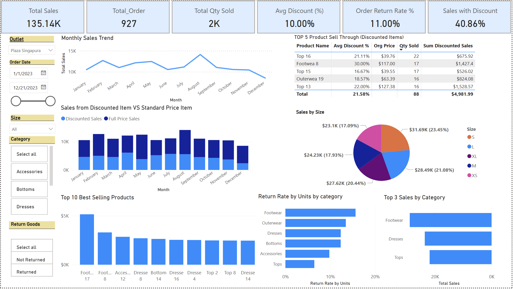

# 👗 Fashion Retail Sales Performance Dashboard

A one-page Power BI dashboard analyzing sales performance, discount behavior, and return patterns for a mock fashion retailer. Built to simulate real-world reporting and decision-making from the perspective of a retail data analyst.

---

## 📌 Project Objective

To provide business insights into:
- The impact of discounts on sales
- Category and product-level sales performance
- Return rates across product types and sizes

This project showcases DAX, interactive dashboard design, slicer logic, and tooltip integration — all within a clean, business-facing layout.

---

## 🗂️ Dataset

- **Source**: Mock dataset (6,000 transactions)
- **Timeframe**: 1 year (2023)
- **Fields Included**: `order_date`, `store_location`, `product_id`, `category`, `size`, `units_sold`, `unit_price`, `discount_percent`, `total_sales`, `returned`

📎 *Note: Cost/profit data not included in this mock set.*

---

## 📊 Key Metrics (DAX Measures)
- **Total Sales**
- **Total Units Sold**
- **Order Count**
- **Average Discount %**
- **Return Rate (by Units)**
- **% of Sales from Discounted Items**
- **Full Price vs Discounted Sales**

---

## 📈 Dashboard Visuals

| Visual | Description |
|--------|-------------|
| 📆 **Line Chart** | Monthly Sales Trend |
| 🧾 **Stacked Column** | Discounted vs Full Price Sales |
| 🛍️ **Top 10 Products** | Ranked by sales |
| 🎯 **Top 3 Categories** | Highest-selling product categories |
| 📉 **Return Rate by Category** | Highlights categories with higher return rates |
| 💸 **Top 5 Discounted Products** | Most sold items under markdowns |
| 📐 **Tooltip Chart** | Product-level summary: Sales, Discount %, Return Rate, Sales by Size |

---

## 🧠 Key Insights

- **~ 40%** of monthly sales came from discounted items, showing strong price sensitivity.
- **Footwear and Dresses** performed well in sales but also showed higher return rates.
- Most items were sold under **10–30% discount brackets**.
- Sales are near evenly spread out on all sizes range but slightly higher on **sizes S and L**. 
- Tooltip pop-ups enhanced product-level context without overwhelming the dashboard.
- Nearly 50% of returned sales came from discounted items, indicating that markdowns may be encouraging less committed purchases. The overall order return rate stands at 11%, which is relatively high for a physical retail environment. It might be worth reviewing the return policy to help reduce unnecessary returns and admin costs.

---

## 🎛️ Interactivity Features

- 📅 Date Range Slicer
- 🏬 Store/Outlet Slicer
- 📦 Category Slicer
- 👗 Size Slicer
- 🔁 Return Status Slicer (with custom labels)
- 💲 Price Type Slicer (Full Price vs Discounted)
- 🪄 Custom Tooltip Page

---

## 🛠 Tools Used

- Power BI
- DAX (Data Analysis Expressions)
- Custom tooltips
- Slicers and visual-level filters

---

## 📁 Files

- `Fashion_Retail_Sales_MockData.xlsx` – Sample dataset
- `FashionSales_Dashboard.pbix` – Power BI file
- `/images/` – Screenshot exports
- `README.md` – Project summary

---

## 📚 Learnings

- How to create focused, business-ready dashboards
- Best practices for DAX formatting, conditional logic, and tooltip design
- Interpreting sales performance in the context of discounting and return behavior

---

## 📸 Preview

---

> 💡 Looking to simulate how markdowns and return behavior impact profit margins in a real-world setting, this dashboard offers clear takeaways for merchandising and operations teams alike.
